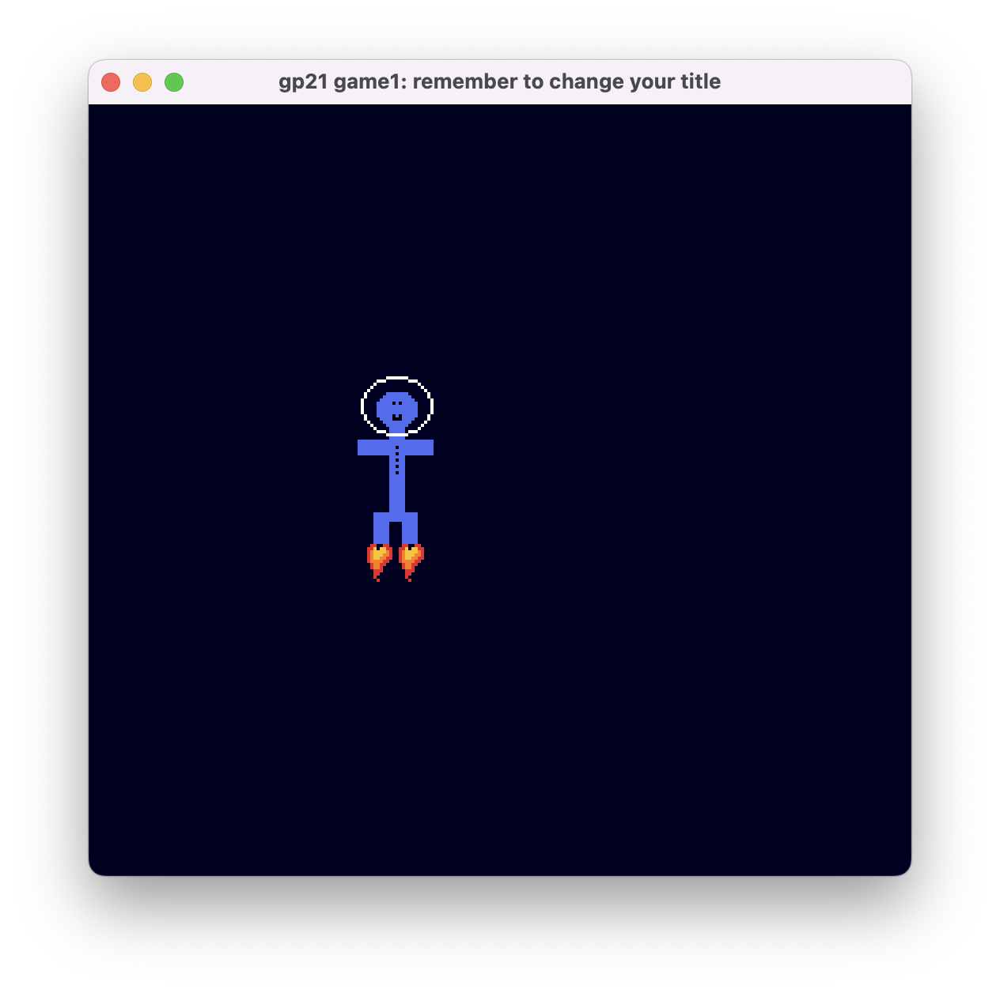

# Spacefield

Author: Yile Xu

Design: A spaceman in space using a jetpack 

Screen Shot:

How Your Asset Pipeline Works:

1. Use load_png() to load png into RGBA format
2. Implement a palette table based on the RGBA values
3. Use the palette table to make the RGBA values represented by 0123
4. Separate the 0123 format into two 01 formats
5. According to the PNG size, separate the 01 values to 8*8 and convert them to bit0s and bit1s
6. Draw them on screen!

How To Play: Press arrow keys to go up, left, and right

Tool I Used: https://www.pixilart.com/draw

This game was built with [NEST](NEST.md).

